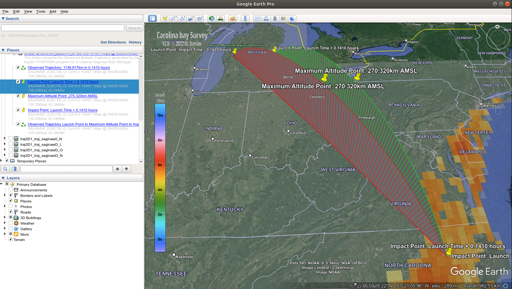

# traj3D #

____________

 

A set of Fortran programs derived from the three-degree of freedom (3DOF) reentry trajectory computer code **TDOF** documented in "Users Manual for the 3DOF Trajectory Computer Program" presented as reference [1].

## Overview ##

Although the **TDOF** computer program was developed for, and employed in, Aerospace Nuclear Safety Program studies pertaining to issues involving launch and reentry of space vehicles containing radioactive material (i.e., see [2],[3]), it is solely used herein to generate ballistic trajectories of notional ejecta material from an hypothesized cosmic body impacting Saginaw Bay, Michigan [4],[5].

The primary motivation to hand code the **TDOF** program from the code listing in Appendix I of reference [1], incorporate necessary changes to make it operational and add functional features was to provide a means to generate ballistic trajectories for comparitive validation of another independently developed ballistic trajectory simulation - **btsim**. This effort was conducted in several incremental steps to arrive at **traj3D1**.

1. Hand code TDOF.f while maintaining line by line statement syntax match with Appendix I card deck listing.
2. Incorporate changes to make TDOF.f operational, such as comment non-functional PUNCH statements, add missing PIF11 function, and add geodesy data output file OPEN and formatted WRITE statements.
3. Copy TDOF.f to traj3D0.f and add functional features, such as calculation and output of geodetic geodesy data, while maintaining basic operational equivalence to **TDOF**.
4. Copy traj3D0.f to traj3D1.f and add functional features, such as inertial or observed trajectory geodesy data output and ground range calculation using geodesic survey methods, while maintaining basic operational equivalence to **traj3D0**.

## Repository Structure ##

The repository main directory contains this README file, plain text disclaimer files and the following script files:

+ **Exec_TDOF** - Bash script to execute ./bin/TDOF.exe with a named namelist input file
+ **Exec_traj3D** - Bash script to execute ./bin/traj3D[0|1].exe with a named namelist input file
+ **create_traj_kml.py** - Python script to create a KML file from a **traj3D** generated trajectory

The contents of each subdirectory are as follows:

+ bin - 3DOF trajectory program executables **(Exists only in local repository workspace)**
+ dat - Geodesy data files generated by 3DOF trajectory program execution
+ doc - Usage documentation
+ kml - KML files for ballistic trajectory display with Google Earth
+ src - Fortran source code for 3DOF trajectory programs
+ out - Standard output files written by 3DOF trajectory program execution
+ txt - 3DOF trajectory program namelist input text files

## Execution Prerequisites ##

The development of traj3D has been conducted on Ubuntu Linux platforms and as such, associated scripts are *nix based. Windows platform users should consider installing WSL2, MSYS2/MinGW or Cygwin to obtain GNU Fortran compiler/library suite, Python 3 release and NumPy package.

1. Fortran compiler to create executables from 3DOF trajectory program source code.
2. Python 3 interpreter and NumPy package to execute **create_traj_kml.py**

## Execution Overview ##

To execute **TDOF** using provided ./txt/sample.txt namelist input file, enter the following command

    ./Exec_TDOF sample

from within the ./traj3D directory. During program execution standard output will be written to ./out/TDOF_sample.out and trajectory geocentric geodesy data (longitude, latitude, altitude) will be written to ./dat/TDOF_geoc_sample.dat. Since geocentric coordinates cannot be used to accurately display paths and trajectories in Google Earth, the **traj3D** programs must be utilized if this capability is desired.

### Basic Ballistic Trajectory Simulation ###

1. Select and modify an appropriate namelist file using preferred text editor, then save
   as a uniquely named namelist text file of the form ./txt/{name}.txt.
2. Invoke **Exec_traj3D** to run a ballistic trajectory simulation with the named namelist fle.
3. Examine ./out/traj3D[0|1]_{name}.out file for simulation results.
4. Utilize ./dat/traj3D[0|1]_{name}.dat file for trajectory presentation and/or analysis.

### Optional Ballistic Trajectory Presentation in Google Earth ###

1. Create a traj_folder_desc_{name}.kml file corresponding to namelist filename.
2. Invoke **create_traj_kml.py** to generate trajectory KML file.
3. In Google Earth add the trajectory KML file as a Network Link.

## Caveats ##

1. Impacts of **TDOF** modifications on validity of ablation heating and skip trajectories have not been evaluated.
2. The capability of **TDOF** to execute multiple cases from a single namelist input file is not applicable when generating ballistic trajectories for subsequent display in Google Earth.
3. Dimensions and mass of an ejecta object are limited by aerodynamic and thermodynamic formulations and the precision of I/O data field formats. The TDOF program was designed to model rocket payloads, not arbitrarily large bodies such as ice or rock boulders.

## References ##

\[1] Perini, L. L., "Users Manual for the 3DOF Trajectory Computer Program", JHU/APL ANSP-M-6, John Hopkins University/Applied Physics Laboratory, Sept. 1973. Web. doi:10.2172/4290244. [Web available at OSTI.gov](https://www.osti.gov/biblio/4290244)

\[2] Hagan, J. C., "Reentry response of the light weight radioisotope heater unit resulting from a Venus-Earth-Earth Gravity Assist maneuver accident". United States: N. p., 1988. Web. doi:10.2172/6520642. [Web available at OSTI.gov](https://www.osti.gov/biblio/6520642)

\[3] Conn, D W, and Brenza, P T., "Preliminary reentry safety assessment of the General Purpose Heat Source module for the Cassini mission: Aerospace Nuclear Safety Program". United States: N. p.,1993. Web. doi:10.2172/10103514. [Web available at OSTI.gov](https://www.osti.gov/biblio/10103514)

\[4] Davias, Michael E. & Harris, Thomas H.S., "A Tale Of Two Craters: Coriolis-Aware Trajectory Analysis Correlates Two Pleistocene Impact Strewn Fields And Gives Michigan A Thumb." GSA 2105 North-Central Section Meeting At: Madison, WI Volume: Vol 47, No. 5. May 2015. [PDF available at ResearchGate.net](https://www.researchgate.net/publication/277304567_A_Tale_Of_Two_Craters_Coriolis-Aware_Trajectory_Analysis_CorrelatesTwo_Pleistocene_Impact_Strewn_Fields_And_Gives_Michigan_A_Thumb)

\[5] Zemora, Antonio, "The Neglected Carolina Bays: Ubiquitous Geological Evidence of a Cataclysm", 2020. [Kindle edition available on Amazon.com](https://www.amazon.com/Neglected-Carolina-Bays-Ubiquitous-Geological-ebook/dp/B08GC8SG8G/ref=sr_1_1?dchild=1&keywords=The+Neglected+Carolina+Bays%3A+Ubiquitous+Geological+Evidence+of+a+Cataclysm+Kindle+Edition&qid=1601067781&s=digital-text&sr=1-1)

## Disclaimers ##

+ See the file [DISCLAIMER-APL](./DISCLAIMER-APL)
+ See the file [DISCLAIMER-GED](./DISCLAIMER-GED)
