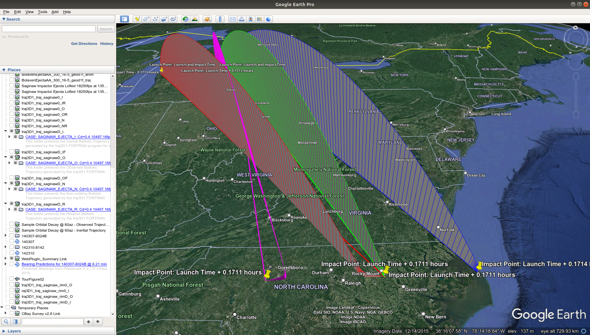

# Preliminary Cases #

This document describes the purpose of provided **traj3D1** input namelist files and associated output files for preliminary cases used in evaluating ballistic trajectories of notional ejecta material from an hypothesized cosmic body impacting Saginaw Bay, Michigan as presented in references [4] and [5] of the **traj3D** project [README](../README.md) file. The KML files associated with these preliminary cases may be added as network links in Google Earth Pro to selectively and interactively view ballistic trajectory folder contents. Each folder contains the following items:

+ Trajectory,
+ Launch Point,
+ Maximum Altitude Point,
+ Impact Point, and
+ Trajectory Launch Point to Maximum Altitude Point to Impact Point Great Circle Paths.

The mass and aerodynamic characterization for notional ejecta as a solid ice sphere approximately one meter in diameter are:

+ Weight =  530.4 lbs,
+ Ref. Area = 8.45 square feet, and
+ Ref. Length = 1.64 feet.

## No-Drag Ballistic Trajectory Simulations ##

For no-drag cases Cd is set to zero for all altitudes and all Mach numbers.

### Relative Initial Launch Conditions ###

To understand the affects of atmospheric drag and Earth rotation on ejecta ballistic trajectories, we first begin by examining a no-drag trajectory as seen by an observer on a rotating Earth, then as traversed in inertial space with respect to time of impact, and finally as traversed over a non-rotating Earth. The notional ejecta will be from the surface of an approximately 1.5 km high ice glacier which may have been located at the hypothesized extraterrestrial impact crater centered at 83.82W longitude, 43.68N latitude in Saginaw Bay, Michigan. The initial conditions represent an object ejected 10000 ft/sec (approx. 3 km/sec) relative to the Earth at 5000 feet above mean sea level (AMSL), with heading azimuth (az) angle of 145 degrees and elevation (gamma) angle of 45 degrees toward the Carolina Bays near Fountain, North Carolina. The no-drag ballistic trajectories generated by **traj3D1** with relative initial conditions for each of three cases shown in Table-1 are depicted as the green, red and blue paths from launch points to impact points in Figure-1.

 
Table-1 traj3D1 No-drag Relative Initial Launch Conditions for Cases 1-3.

 | Case | Name | ROTOPT | H0 | VREL | AZREL | GAMREL | TFINAL | Color |
 | ---: | :--- | -----: | -: | ---: | ----: | -----: | -----: | :---- |
 | 1 | saginaw0_OR |  1.0 | 5000 | 10000 | 145 | 45 | -1.0 | Green |
 | 2 | saginaw0_IR |  1.0 | 5000 | 10000 | 145 | 45 | 507.596 | Red |
 | 3 | saginaw0_NR |  0.0 | 5000 | 10000 | 145 | 45 | -1.0 | Blue |

 

 
Figure-1 traj3D1 No-drag Ballistic Trajectories in Google Earth Pro for Cases 1-3.
  
 

Although the impact points at 0.141 hours (8.46 min) from launch for cases 1 and 2 are in Bay ID 142310-8142 of the [Carolina Bay Survey, Version 2.8](http://cbaysurvey.cintos.org/) (see Figure-2), the apparent launch points are at two different locations due Earth rotation. In case 1 an observer, from a sufficiently high enough view point above a fixed location on Earth, would see the ejecta launched from Saginaw Bay and impact near Fountain. However, during this 8.46 minutes as the ejecta is traversing the red path in inertial space, points on Earth are rotating eastward with respect to the stationary red path. When the ejecta impacts near Fountain, the launch location fixed in inertial space would appear to be westward of Saginaw Bay while at the same latitude as the launch point.

 
Figure-2 traj3D1 No-drag Ballistic Trajectories Impact Points in Google Earth Pro for Cases 1-2.
  
 

Another distinction between observed and inertial cases is the green observed trajectory ground track, as seen from the launch point, has a noticable curvature to the left of and back toward the great circle ground path between launch and impact points (see Figure-3), while the red inertial trajectory and its ground track remain in the same elliptic plane which contains the great circle ground path between launch and impact points (see Figure-4). This curvature is due to the Coriolis effect from Earth rotation as further illustrated when examining the blue trajectory of the non-rotating Earth case.

 
Figure-3 traj3D1 No-drag Ballistic Trajectories Observed Trajectory Ground Track in Google Earth Pro for Case 1.
  
 

 
Figure-4 traj3D1 No-drag Ballistic Trajectories Inertial Trajectory Ground Track in Google Earth Pro for Case 2.
  
 

The observed trajectories for rotating and non-rotating Earth cases have the same launch points, but different impact points as shown in Figure-1. There are two factors, both due to Earth rotation, which cause this difference. The first is due to the velocity added by Earth rotation, which affects the initial inertial launch velocity magnitude and direction as seen in the **traj3D1** standard output files for cases 1-3 and summarized in Table-2.

 
Table-2 traj3D1 No-drag Initial Relative and Inertial Launch Conditions for Cases 1-3.

 | Case | H0 | VREL | AZREL | GAMREL | VI | AZI | GAMI |
 | ---: | :- | ---: | ----: | -----: | -: | --: | ---: |
 | 1 | 5000 | 10000 | 145 | 45 | 10497.16 | 138.2964 | 42.3469 |
 | 2 | 5000 | 10000 | 145 | 45 | 10497.16 | 138.2964 | 42.3469 |
 | 3 | 5000 | 10000 | 145 | 45 | 10000 | 145 | 45 |

 

The second, as mentioned earlier, is due to the Coriolis effect. Notice that unlike the observed green trajectory for the rotating Earth case, the observed/inertial blue trajectory ground track as seen from the launch point does not exhibit curvature to the left of and back toward the great circle ground path between launch and impact points (see Figure-5). Also, as with the red inertial trajectory, the blue trajectory and its great circle ground track remain in the same elliptic plane which contains the great circle ground path between launch and impact points.

 
Figure-5 traj3D1 No-drag Ballistic Trajectories Non-Rotating Earth Trajectory Ground Track in Google Earth Pro for Case 3.
  
 

### Inertial Initial Launch Conditions ###

Since it was shown above that initial inertial launch conditions for the non-rotating Earth case differed from the other two rotating Earth cases, all three cases were rerun with inertial initial launch conditions instead of relative initial conditions. The no-drag ballistic trajectories generated by **traj3D1** with inertial initial conditions for each of three cases shown in Table-3 are depicted as the green, red and blue paths from launch points to impact points in Figure-6.

 
Table-3 traj3D1 No-drag Inertial Initial Launch Conditions for Cases 4-6.

 | Case | Name | ROTOPT | H0 | VI | AZI | GAMI | TFINAL | Color |
 | ---: | :--- | -----: | -: | -: | --: | ---: | -----: | :---- |
 | 4 | saginaw0_O | 1.0 | 5000 | 10497.16 | 138.2964 | 42.3469 | -1.0 | Green |
 | 5 | saginaw0_I | 1.0 | 5000 | 10497.16 | 138.2964 | 42.3469 | 507.596 | Red |
 | 6 | saginaw0_N | 0.0 | 5000 | 10497.16 | 138.2964 | 42.3469 | -1.0 | Blue |

 

 
Figure-6 No-drag traj3D1 Ballistic Trajectories in Google Earth Pro for Cases 4-6.
  
 

The observed green and inertial red trajectories for cases 4 and 5 are identical to cases 1 and 2 respectively. The non-rotational blue trajectory for case 6 resembles inertial red trajectories for cases 2 and 5 with identical time of flight, but shown with respect to time of launch instead of time of impact as seen in Figure-7 below.

 
Figure-7 No-drag traj3D1 Ballistic Trajectories in Google Earth Pro for Cases 2, 3, 5 & 6.
  
 

## Atmospheric Drag Ballistic Trajectory Simulations ##

In [Systematic by Latitude](http://cintos.org/SaginawManifold/Modeling/styled-71/page121.html) subsection of [Modeling of The Inferred Orientation of Carolina bays](http://cintos.org/SaginawManifold/Modeling/index.html) the reduction of hypersonic reentry velocity to subsonic terminal velocity of hypothesized ejecta "droplets" is estimated to be resultant of atmospheric force corresponding to a drag coefficient (Cd) of about 0.3.

For atmospheric drag cases, Cd is set to 0.0001 for altitudes from 0 to 500000 feet when flight path angle gamma is equal to or greater than SWGAM, and when less than SWGAM the Cd vs Mach model shown in Table-4 derived from figure 1 of reference [1] is used.

 
Table-4 Spherical Ejecta Drag Model.

 | Mach | Cd |
 | ---: | -: |
 | 0.0 | 0.4 |
 | 0.5 | 0.5 |
 | 1.0 | 0.9 |
 | 1.5 | 1.0 |
 | 4.0 | 0.9 |
 | 25.0 | 0.9 |

 

 
### Full Atmospheric Drag ###

The full atmospheric drag ballistic trajectories generated by **traj3D1** with inertial initial conditions for two cases shown in Table-5 are depicted as green and red paths from launch point to impact point in Figure-8. For both cases, the entered SWGAM value delays application of the ejecta drag model presented in Table-4 until the relative flight path angle drops from initial 45 degrees to below 44.9. This mitigates integration of state discontinuties during the first fractional seconds of flight as the ejecta decelerates from its initial Mach 9 velocity.

 
Table-5 traj3D1 Full Atmospheric Drag Inertial Initial Launch Conditions for Cases 7-8.

 | Case | Name | ROTOPT | SWGAM | H0 | VI | AZI | GAMI | TFINAL | Color |
 | ---: | :--- | -----: | ----: | -: | -: | --: | ---: | -----: | :---- |
 | 7 | saginawD_OF | 1.0 | 44.9 | 5000 | 10497.16 | 138.2964 | 42.3469 | -1.0 | Green |
 | 8 | saginawD_IF | 1.0 | 44.9 | 5000 | 10497.16 | 138.2964 | 42.3469 | 65.638 | Red |

 

 
Figure-8 traj3D1 Full Atmosphere Drag Ballistic Trajectory in Google Earth Pro for Cases 7-8.
  
 

Ballistic trajectories shown in Figure-8 depict an improbable scenario since the impact points are well within the area of an hypothesized cosmic impact. The first minutes of cosmic impact would create a chaotic and highly dynamic environment affecting atmospheric molecular, temperature and pressure properties for aerodynamic drag modeling. The selected SWGAM delay is a very conservative and unrealistic earliest bound to an unperturbed atmosphere through which ejecta traverse. A more realistic modeling assumption would be to delay atmospheric drag calculations until the ballistic trajectory reentry phase where ejecta would be traversing though a less chaotic atmosphere; assuming no affects from companion ejecta and distant cosmic impact.

### Reentry Only Atmospheric Drag ###

The reentry only drag ballistic trajectories generated by **traj3D1** with initial inertial conditions for each of three cases shown Table-6 are depicted as the green, red and blue paths from launch points to impact points in Figure-9.

 
Table-6 traj3D1 Reentry Only Drag Initial Inertial Launch Conditions for Cases 9-11.

 | Case | Name | ROTOPT | SWGAM | H0 | VI | AZI | GAMI | TFINAL | Color |
 | ---: | :--- | -----: | ----: | -: | -: | --: | ---: | -----: | :---- |
 | 9 | saginawD_O | 1.0 | 0.0 |5000 | 10497.16 | 138.2964 | 42.3469 | -1.0 | Green |
 | 10 | saginawD_I | 1.0 | 0.0 | 5000 | 10497.16 | 138.2964 | 42.3469 | 615.839 | Red |
 | 11 | saginawD_N | 0.0 | 0.0 | 5000 | 10497.16 | 138.2964 | 42.3469 | -1.0 | Blue |

 

 
Figure-9 traj3D1 Reentry Only Drag Ballistic Trajectories in Google Earth Pro for Cases 9-11.
  
 

The ballistic trajectories for all three reentry drag case exhibit steepening of the gamma angle as the ejecta approaches its terminal velocity phase. For the observed green and non-rotational blue paths, the terminal trajectory bearing appears to remain relatively constant. For the inertial red path, the trajectory deviates from the elliptic launch plane in an eastward direction as the ejecta loses velocity in the longitudal direction due to drag while falling nearly vertically over the rotating Earth. The apparent eastward motion toward the point of impact is due entirely to Earth's rotation.

## Conclusions ##

The non-drag ballistic trajectory simulations exhibit characteristics -- primarily time of flight, range, maximum altitude and inclination angle at impact -- espoused by Antonio Zemora in the "Extraterrestrial Impact amd Ballistic Flight" section of his book entitled "The Neglected Carolina Bays: Ubiquitous Geological Evidence of a Cataclysm" identified as reference [5] of the **traj3D** project [README](../README.md) file.

The reentry only atmospheric drag ballistic trajectory simulations exhibit skewing of the bearing angle at impact in rotational direction, but not magnitude as illustrated by Michael Davias in his [Modeling of The Inferred Orientation of Carolina bays](http://cintos.org/SaginawManifold/Modeling/index.html) analysis. Modeling aerodynamic drag for an ejecta object as that of a smooth solid ice sphere one meter in diameter while discounting surface roughness, flow separation, ablation and fragmetation, understandably produces extremely course results.

The inbound headings of **traj3D1** generated observed and inertial ballistic trajectories for no-drag and reentry only drag cases shown below in Figures 10 and 11 respectively, demonstrate a difference with respect to orientations of Carolina Bays in the vicinity of the impact points. Besides aerodynamic drag uncertainties due to turbulent atmospheric properties, ejecta size and composition, other factors which may account for these differences are ejecta launch location, altitude, speed, azimuth and elevation.

 
Figure-10 traj3D1 No-drag Ballistic Trajectories Impact Points in Google Earth Pro for Cases 4-5.
  
 

 
Figure-11 traj3D1 Reentry Only Drag Ballistic Trajectories Impact Points in Google Earth Pro for Cases 9-10.
  
 

## References ##

[1] Carter, R. T., Jandir, P. S., Kress, M. E., "Estimating the Drag Coefficients of Meteorites for All Mach Number Regimes", 40th Lunar and Planetary Science Conference, Id. 2059, March 2009. Web available at:  
[https://www.lpi.usra.edu/meetings/lpsc2009/pdf/2059.pdf](https://www.lpi.usra.edu/meetings/lpsc2009/pdf/2059.pdf)

[2] Spearman, Leroy M., Braswell, Dorothy O., "Aerodynamics of a sphere and an oblate spheroid for Mach numbers from 0.6 to 10.5 including some effects of test conditions", NASA-TM-109016, NASA Langley Research Center Hampton, VA, United States, August 1, 1993. Web available at:  
[https://ntrs.nasa.gov/citations/19940008699](https://ntrs.nasa.gov/citations/19940008699)